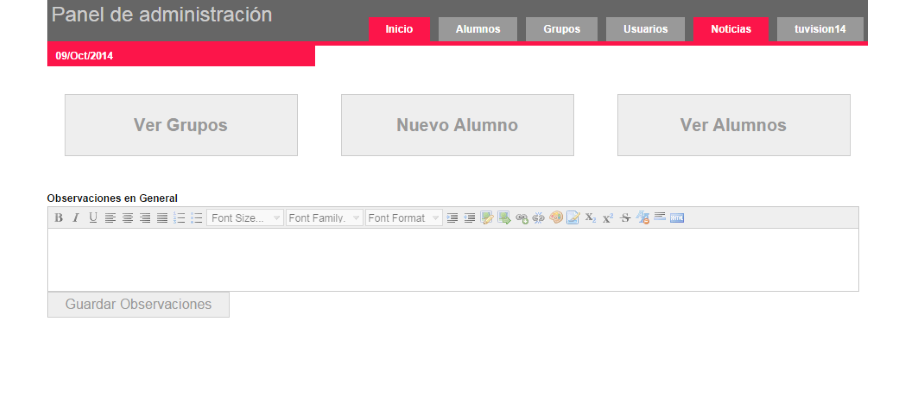
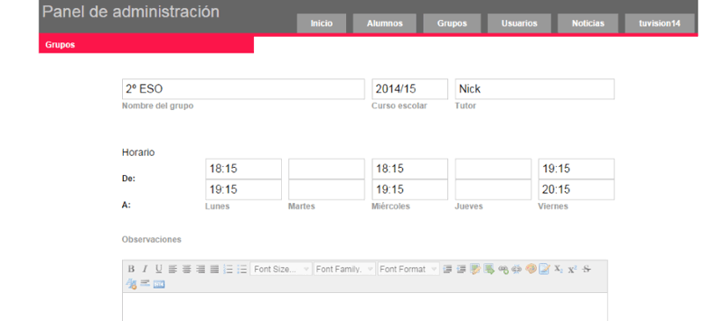
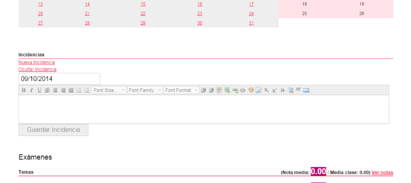

**Thompson English Centre** es una academia de inglés con muchos años de experiencia y con docentes altamente cualificados. Para ellos se desarrollo una nueva web y junto a esta **una area privada donde poder administrar** la gestión educativa de la academia.

Desde la zona privada los alumnos y padres pueden ver el progreso de las clases, calificaciones y notas de los profesores a los padres, las cuales ademas reciben por email en cada evaluación o cuando los profesores consideren que deben informar.

Desde el **backoffice desarrollado para TEC** pueden administrar los frupos, horarios, alumnos y todo lo relacionado con las clases, notas, incidencias, asistencia, comportamiento, antiguos alumnos, etc. Todo ello se puede recoger en un informe customizable, listo para enviar por email. 

Todo el gestor está construido con PHP usando un sistema propio de archivos XML para gestionar los datos y JS en el front para mejorar la usabilidad.

