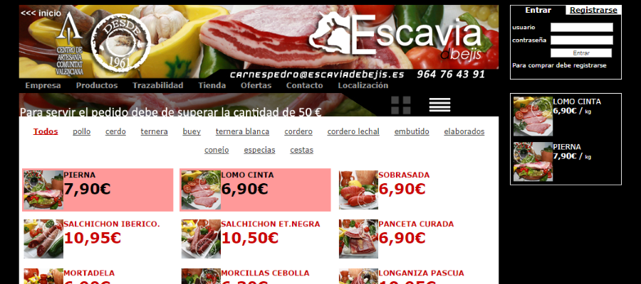
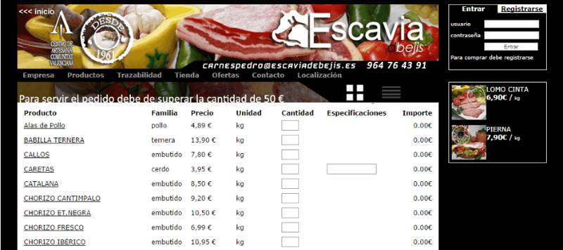

Para este mayorista de productos cárnicos, se creó un sistema para permitir a sus clientes **realizar los pedidos online** a cualquier hora, en lugar de hacerlo de la antigua manera a través del contestador del teléfono.

Cualquier visitante puede ver los productos y sus precios, pero los clientes registrados pueden además **enviar el pedido directamente al almacén**. Desde la propia web, los clientes pueden seleccionar la cantidad de cada uno de los productos, indicar alguna observación si lo necesitan y saber el coste total del pedido. El pedido se envía directamente al mayorista pra la distribución al día siguiente.

Además cuentan con un **panel de administración** donde ver el historico de pedidos, el estado de los mismos y anotar incidencias.

El backend comunica mediante PHP con la misma Base de Datos de su software de gestión de almacén, manteniendo el stock siempre actualizado y sincronizado.

