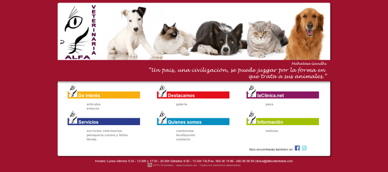

**Alfa veterinaria** es una clínica para mascotas en Castellón de la Plana. La principal característica de esta clínica es que su directora es una doctora gran estudiosa del tema y escribe regularmete sobre los animales, enfermedades, tratamientos y consejos.

Su web además de mostrar la **información corporativa** propia del establecimiento, ubicación, contacto o productos, debía tener un espacio donde **publicar sus artículos** de una forma más flexible que los blogs que habían en ese momento.

Por otro lado se potenció el lado social de la web, antes de Instagram, los usuarios **colgaban fotos de sus mascotas** y podían comentarse entre si.

Realizado en PHP todo el backend y con JS para el frontend. El diseño se ajustó al cliente y todas las funcionalidades se crearon a medida.

