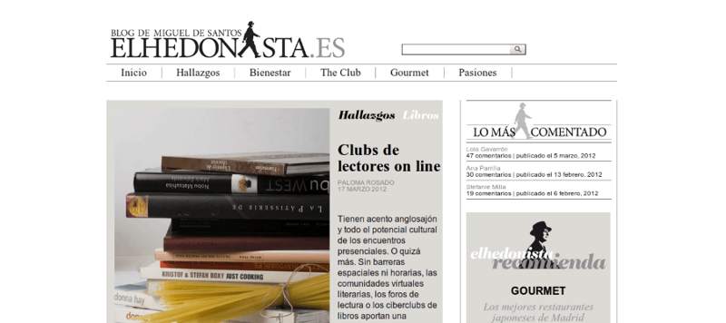

Blog sobre tendencias, moda y estilo de vida de Miguel Santos **elhedonista.es**

El objetivo de este proyecto es realizar un blog al estilo revista editorial con diferentes tipos de contenido y a medida para nuestro cliente.

Desarrollé un tema para **Wordpress a medida** de los requerimientos, pensando en la **modularidad y escalibilidad**, con el fin de poder ampliar los tipos de contenidos más adelante y que sea fácil de gestionar.

Se presentaba el reto de un alto nivel de exigencia gráficamente y la **posibilidad de emplear diferentes plantillas y estilos** para las distintas secciones. Una tipografía cuidada, colores cuidadosamente escogidos y atención a los pequeños detalles marcan la diferencia.

