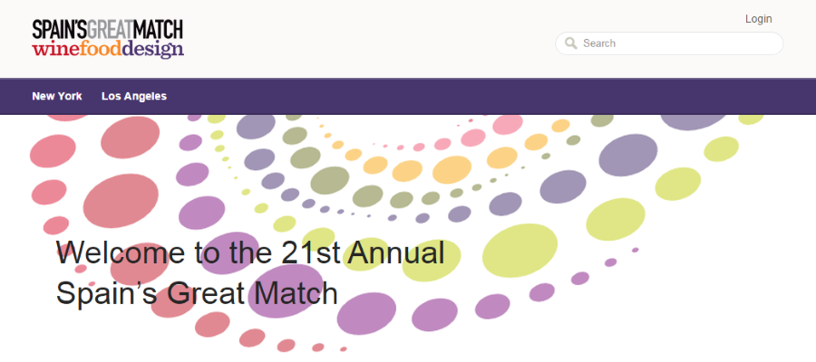
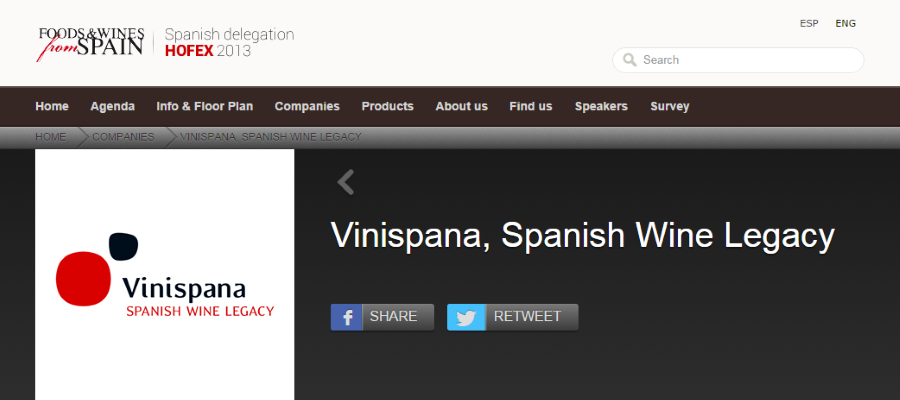
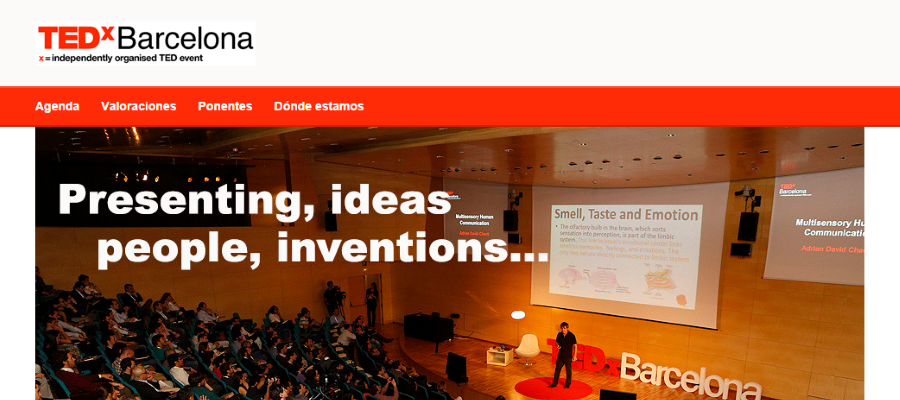
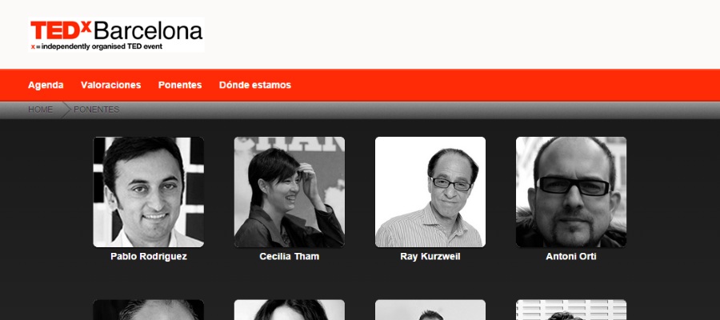
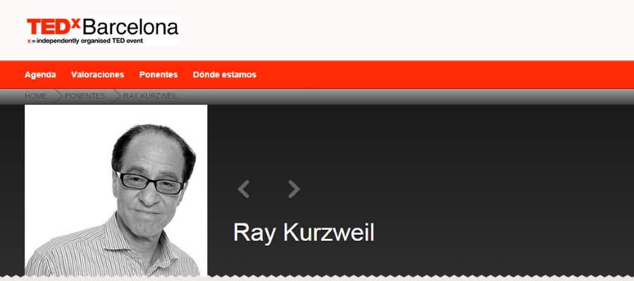

**Director técnico** del área a cargo del desarrollo de una webapp con Wordpress enfocada a la gestión de eventos gastronómicos y apta para cualquier tipo de evento o actividad (huddleapp.es), además de desarrollar los diseños web de las páginas corporativas y gestionar todos los aspectos técnicos de la empresa.

He sido el responsable de todo el código y las funcionalidades de la herramienta y garantizar la calidad del producto al entregárselo a los clientes. He tratado directamente con los clientes y participado activamente del proceso de selección de nuevo personal.

Trabajando en HuddleApp he podido desarrollar proyectos para grandes empresas como **ICEX, TED, D.O. Rueda, Institut del cava, Gallina Blanca**, entre otros.

