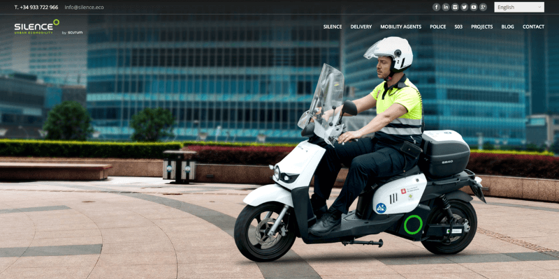
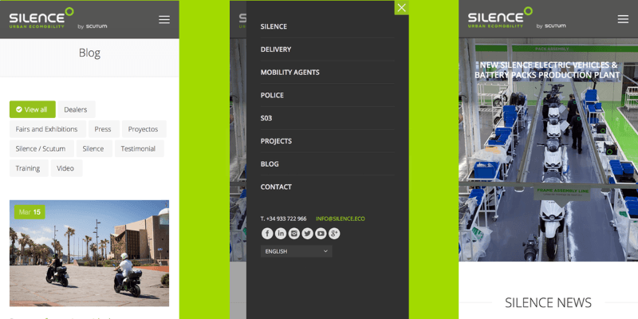

**Scutum** (Ahora Silence) es una empresa de Barcelona que quiere acabar con el problema y liderar un cambio hacia la movilidad eléctrica responsable. Por ello fabrican scooters eléctricos tanto para sectores públicos como privados.

Junto con el rebranding que se le estaba realizando, se diseño una nueva web para mostrar su proyecto, sus modelos y donde poder mostrar la actualidad del mundo de la mobilidad sostenible, un blog.

Todo ello de manera que puedan auto gestionarlo ellos mismos y en dos idiomas, a causa de su inmediata expansión internacional.

La solución fue un **tema de Wordpress customizado** a sus necesidades, prestando atención al detalle y buscando soluciones particulares a sus necesidades.

