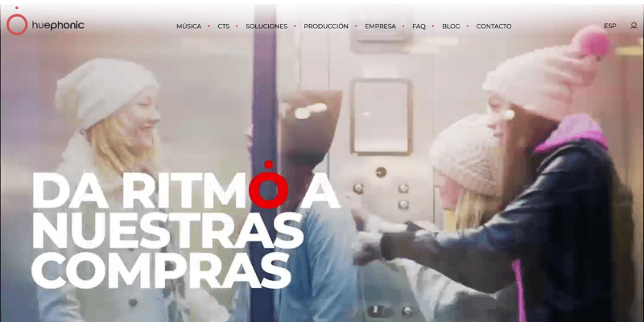
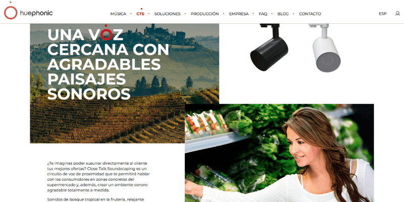
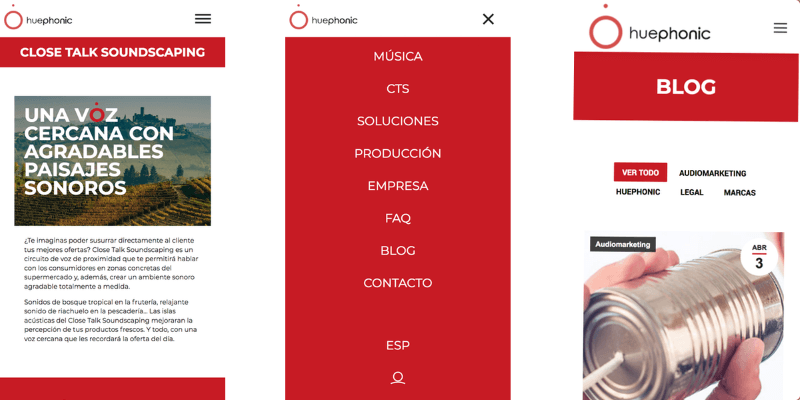

**Huephonic** es una empresa dedicada al sónido, y como tal el aspecto multimedia de la web debía ser una prioridad. Entre los requerimientos constaba un peso muy importante al sonido y video, junto a contenidos editables y autogestionados, y una imagen nueva y rompedora.

Para poder conseguir todo lo requerido, se decidió separar la web en dos partes, la mayor parte de ella se gestionaria mediante **Pico CMS**, un flat file CMS, dejando **Wordpress** para el blog y las FAQs. Con esta decisión se consiguió mayor libertad y flexibilidad a la hora de maquetar la web corporativa, pero se añadió el reto de hacer coincidir los estilos de ambas partes.

El resultado fue una web vistosa y divertida, con tienpos de respuesta muy rápidos, contenidos dinámicos, audio y video, y **totalmente pensada para móviles**.

