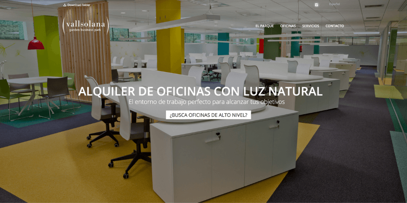
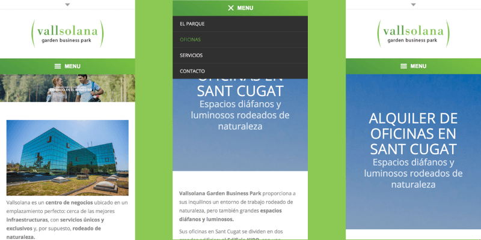

**Vallsolana** es un edificio de oficinas situado en un Parque de Sant Cugat, el cual cuenta con clientes muy reconocidos a nivel mundial.

El resto de este proyecto fue fundamentalmente el tiempo, ya que por diversos motivos debía terminarse en un plazo de 3 dias. Para ayudar con el desarrollo se optó por emplear **Wordpress** y customizar un tema para que se adaptara al gusto del cliente.

Por suerte no disponia de mucha información ni de blog que gestionar y todo salió al gusto del cliente,

