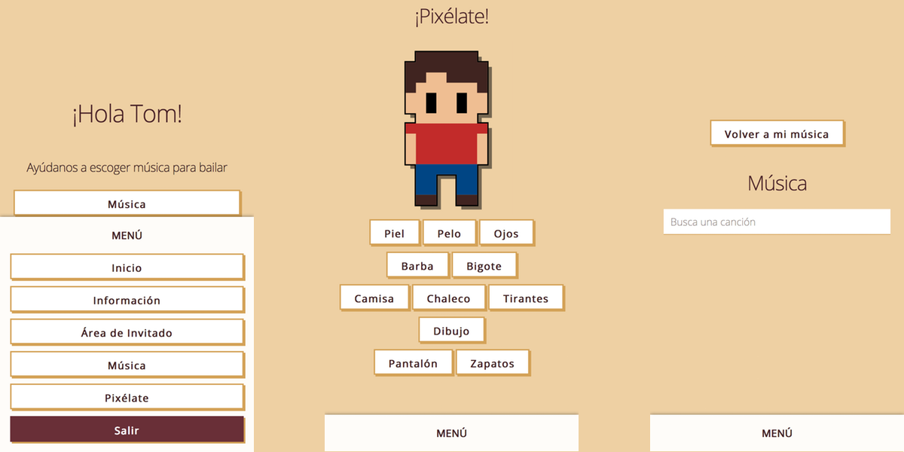
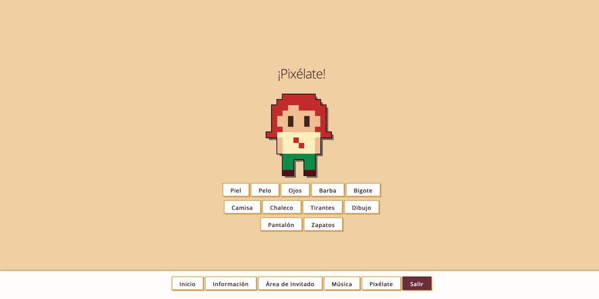

Para nuestra boda, quisimos hacer nosotros mismos todo lo que estuviera a nuestro alcance, para ello desarrolle una webapp pensando en nuesros invitados y la preparación de la boda.

Los invitados recibieron la _invitación virtual_ por correo y podían confirmar asisitencia, cuantos serían, indicaciones alimentarias. O si no podían asistir, enviar un mensaje de su parte que guardamos con cariño.

Para los confirmados, además de la información del lugar, el horario del evento, donde aparcar, etc, podían sugerirnos música para la fiesta, a través de la **API de Spotify** que luego enviamos a nuestro DJ.

Para rematar el asunto, creé una aplicación con JS y SVG para poder crear unos avatares personalizados, que después sirvieron para marcar los puestos en la mesa.

Todo fue realizado con **JS, Firebase y mucho cariño**.

