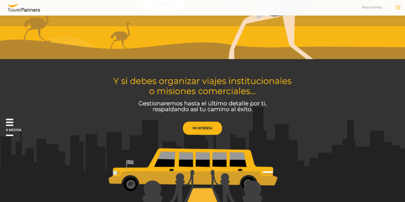

**Travel Partners** organiza viajes organizados de alto nivel para empresas e instituciones. Para su nueva imagen necesitaban una web a la altura de sus clientes. Por ello decidimos desarrollar una web con los más altos estándares de calidad en diseño e interacción.

Debía disponer de tres idiomas, blog autogestionado y ser visualmente rompedora. Partimos de la base de **Wordpress** pero con plantillas completamente customizadas para poder conseguir efectos parallax que juegen con las imágenes.

El resto era cnoseguir que esta interacción entre scroll e imágenes funcione en cualquier resolución. Al final la web es de las más curiosas y diferentes del sector y un referente para la competencia.

