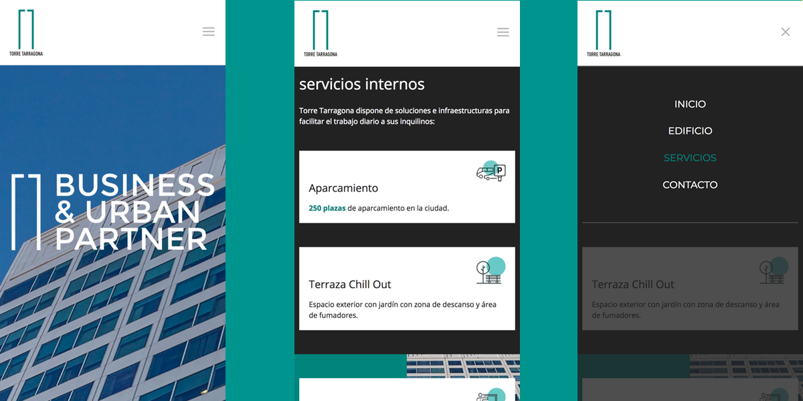
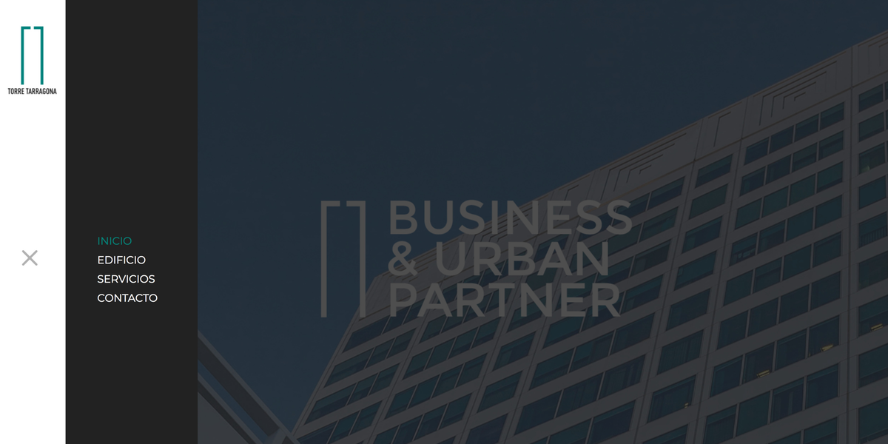
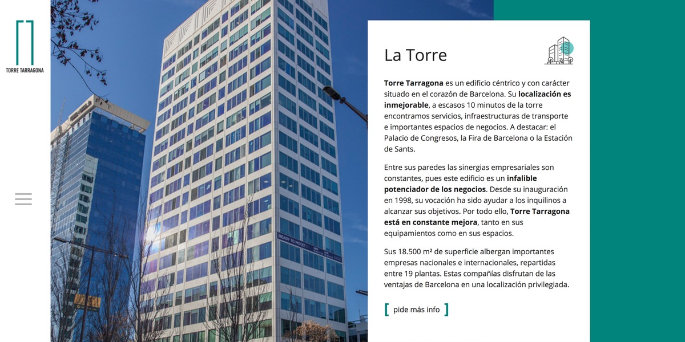

**Torre tarragona** es un importante y céntrico edificio de oficinas situado entre la popular Estacion de FF.CC. Barcelona Sants y la concurrida Plaça Espanya, lugar donde se celebran algunas de las más importantes ferias de Barcelona.

El edificio precisaba de una nueva web donde mostrar la información básica, servicios y un lugar donde poder contactarles. Debido a que no precisaban de autogestión de los contenidos, ni un blog donde publicar sus noticias, pudimos prescindir de CMS pesados como Wordpress y emplear alternativas más livianas.

Teniendo en mente el **mobile first** pensé en la priorizar la velocidad de carga y navegación, por ello usé **pico CMS** un CMS flat files para distrubuir lás páginas y descargar el frontend de elementos pesados como widgets de redes sociales, mapas y todo lo que no sea imprescidible.

Usando JS y CSS para ofrecer transiciones y animaciones de interacción para dar sensación de fluidez en la navegación, junto a un tiempo de carga casi nulo ufrece a los visitantes justo la información que necesitan al momento.

