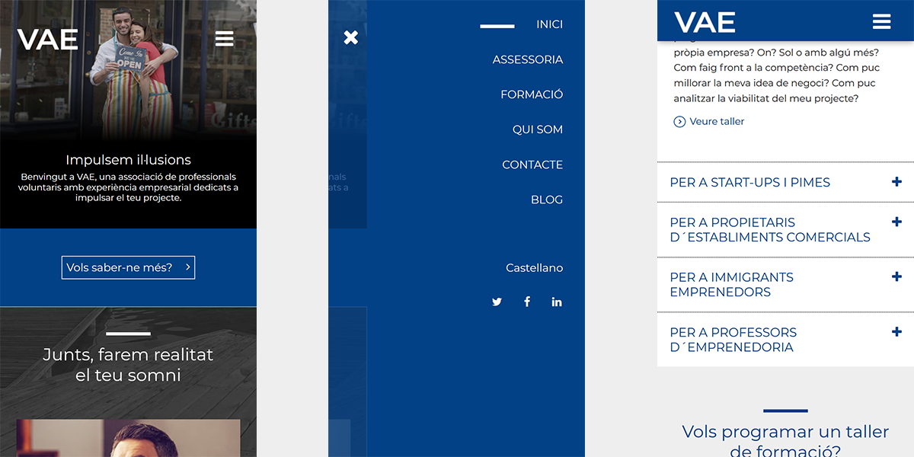
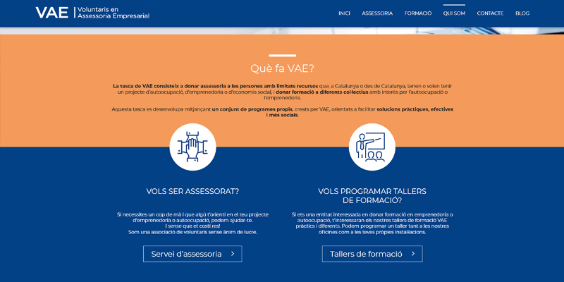
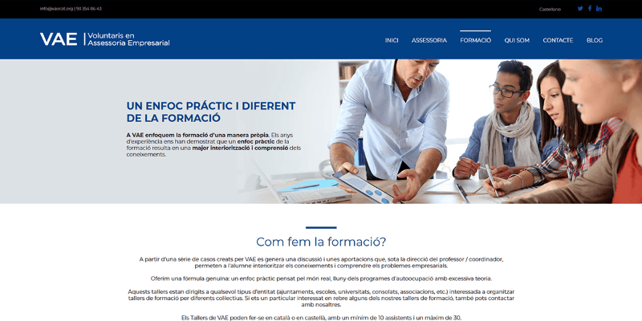

**VAE** es una asociación de voluntarios - profesionales experimentados y comprometidos con los problemas de la sociedad de hoy - que quieren devolver a la sociedad, de manera altruista, los conocimientos empresariales que les ha dado.

Para este cliente ofrecimos una solución en dos partes, por un lado la parte corporativa, más estática, se montó mediante **Pico CMS** un flat file CMS que proporciona fluidez y velocidad, dejando el cásico **Wordpress** para la sección de blog. De esta forma obtenemos una web ligera y atractiva para el usuario de móvil sobre todo, y permitimos la autogestion del blog al cliente.

La solución hibrida nos abrió paso a una nueva serie de desarrollos para otros clientes, obteniendo **diseños más flexibles, tiempos de producción más breves y mejor rendiemto y seguridad.**

