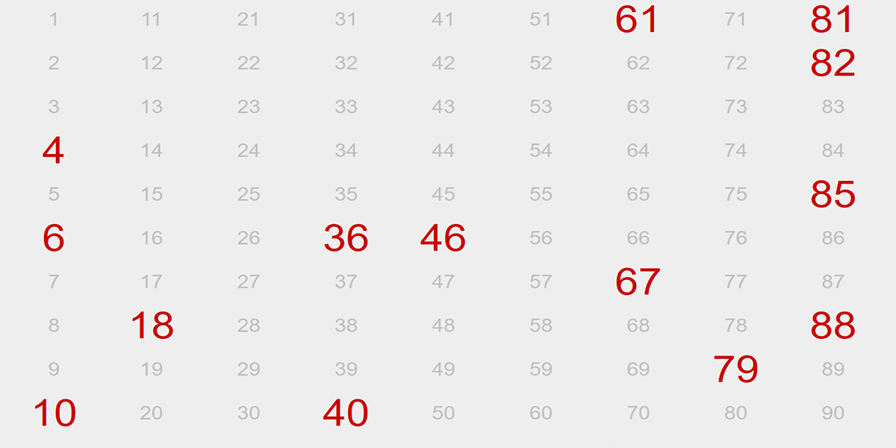
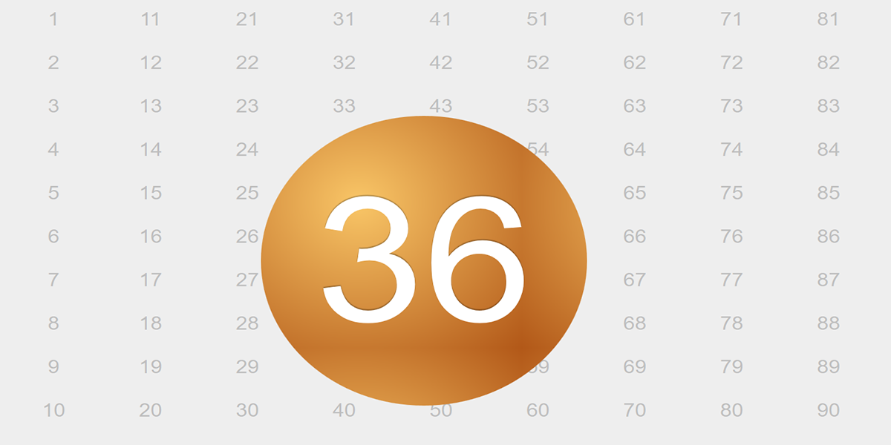

Creé esta app para que mi padre y sus amigos puedan jugar al bingo cómodamente. Pensando en la mejor forma de que puedan ver los números pensé en un panel a pantalla completa donde contrastan mucho los números que ya ahn salido. Este panel sólo se tapa cuando sale la bola.

Mediante las animaciones se guia la vista de los usuarios para facilitar el seguimiento de los números. La bola aparece desde arriba, y se queda en grande en la pantalla hasta que se ha pronunciado su número, despues se mueve hasta su posición en el panel y se _ilumina_.

Por detrás dispone de una lógica de doble semilla para obtener números realmente aleatorios, y guarda un registro en local de los números obtenidos para analizar si los resultados desvían de alguna forma. Hasta este momento siempre se han mantenido dentro de los límites de **+/-3σ**.

Toda la app esta desarrollada en un único archivo HTML, con el JS y CSS incrustado, de forma que puede ser ejecutado desde cualquier ordenador, sin necesidad de internet ni gestionar ningún servidor, además de estar optimizado para su monitor. Requisitos necesarios para que mi padre pueda usarlo en su residencia de verano.

Puedes jugar al bingo desde [Aquí](http://tomascornelles.com/bingo/). Aún me queda pendiente estandarizarlo y ajustarlo a todas las resoluciones.

