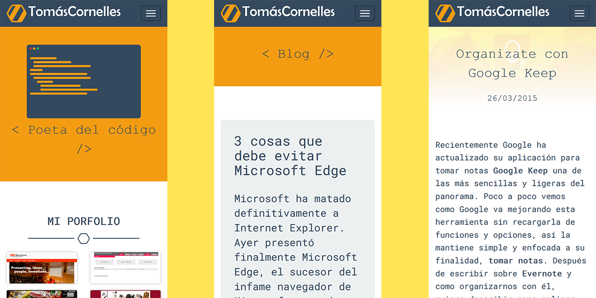
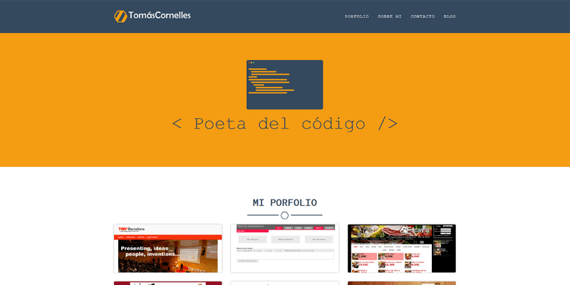

En el año 2014, decidí a crear un sitio personal donde mostrar un poco de mi porfolio, mi CV y mostrarme como profesional para encontrar un nuevo trabajo. Más tarde le añadí el blog donde poder ir escribiendo sobre lo poco que sé, pero que me parece interesante.

Además de la web desarrollé un nuevo logo, que empleaba una variante del avatar que llevaba usando años en las redes, el hexágono de benceno en referencia a la **química** y colores flat UI para unificar la interfaz. Un trabajo de principiante, pero que como todo, lo hice con cariño.

Decidí nusar un sistema sin bases de datos, para agilizar la carga y mejorar el rendimiento. Por ello me decanté por **Pico** un flat file CMS que me permite gestinar las rutas y plantillas por un lado, y los contenidos en **Markdown** por otro.

Más tarde, para el blog amplié las funcionaliades del CMS y le dí un aspecto lo más sencillo posible, con el fin de centrarse en la lectura.

