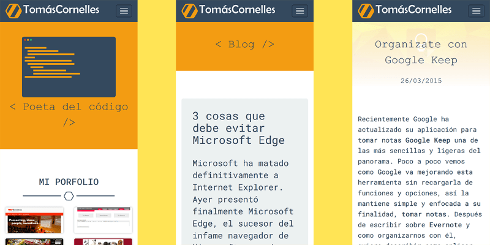

En 2018 empecé jugando con un nuevo logo para mi amrca personal, a modo de ejercicio, para aprender y disfrutar del proceso. Ese ejercició acabó en un rebranding completo de mi mismo, **nuevo logo**, **nueva web** y **nuevas tecnologías**.

En la web anterior usé **Pico CMS** como gestor, y **Markdown** para los contenidos. En esta ocasión busqué una alternaiva más avanzada, pero con los mismo principios. Por ello escogí **Grav CMS**, que ofrece la misma base que _Pico_ además de ser más extensible, con más documentación y un panel de administrador completo.

El punto más importante fue emplear **Accelerated Mobile Pages** (AMP) para el front. Una tecnología de Google para ofrecer páginas más rápidas y livianas para el usuario de móvil. Para que una página sea válida peara **AMP** ha de cumplir ciertos requisitos muy rigurosos, y me enorgullece decir que esta web los cumple todos, incluso en la [página 404](404).

La nueva web centrada en el usuario móvil ofrece todo el contenido que quiero mostrar sin aditivos superfluos e innecesarios. Por ello la pasé por varios checks de rendimiento y accesibilidad:
- **[AA](http://wave.webaim.org/report#/http%3A%2F%2Ftomascornelles.com)**: Cumple con el nivel doble A de accesibilidad
- **[AMP](https://validator.ampproject.org/#url=http%3A%2F%2Ftomascornelles.com)** (excepto 404)
- **[Page Insign](https://developers.google.com/speed/pagespeed/insights/?url=http%3A%2F%2Ftomascornelles.com%2F)** Mobile:93/100 - Desktop:84/100
- **[Pingdom](https://tools.pingdom.com/#!/nC2Jy/http://tomascornelles.com/)** 83/100

