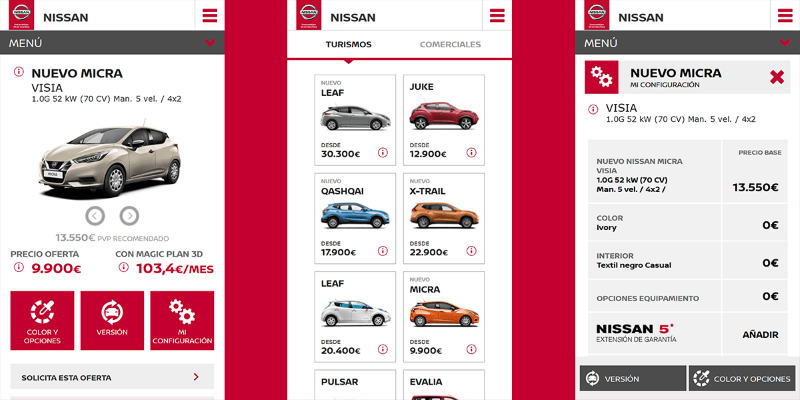

Al entrar a trabajar para **Plan Comunicación** empecé por ayudar en el desarrollo de la versión mobile del configurador de **Nissan**. Se trata de un proyecto de gran envergadura en el cual se replicaron casi todas las funcionalidades de la versión de escritorio, pero adaptadas a dispositivos móviles.

Entre las funcionalidades destacan el selector de equipamientos, de colores animado, buscador de concesionario por geolocalización, o la calculadora de cuotas que más adelante reconstruiría por completo a nivel interno.

Esta plataforma es una de las principales de Nissan Iberia para la conversión de visitas y la plataforma local más importante.

