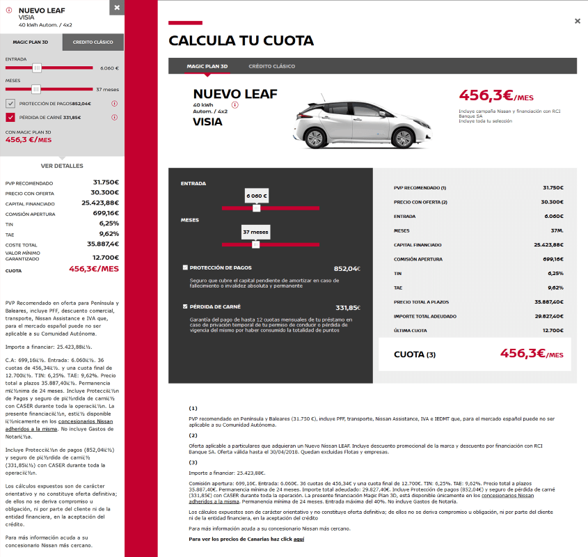

La calculadora financiera de **Nissan**, es la aplicación mediante la cual se obtienen las cuotas de financiación de cada vehículo. Antes de tomar este proyecto, el JS responsable de los cálculos y visualización de datos, estaba integrado con el resto de scripts y directamente enlazado con el DOM, lo que hacía casi imposible poder reutilizarla para futuros proyectos.

El objetivo principal era "aislar" los cálculos del resto, sin que se vieran afectados de ningún modo los cálculos actuales. El resultado fue una **librería independiente** que realiza los cálculos sobre un objeto que se genera con los datos del vehículo.

Al tener preparado un "objeto base" con datos reseteados permitió poder **calcular además cualquier tipo de financiación**, independientemente de su origen. De esta forma a la misma libreria se accede desde varias plataformas para obtener las cuotas y valores financieros en dos paises, vehículos nuevos, de ocasión, para pasrticulares, empresas y concesionarios.

Todo eso **sin tener que modíficar el core** de cálculo desde que fuera publicado.

