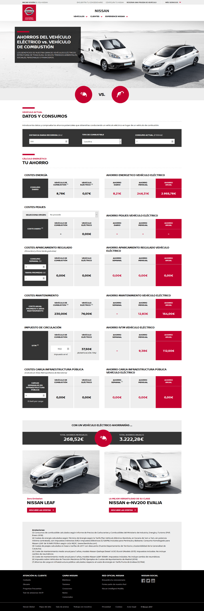

Se trata de una calculadora comparadora de los gastos entre un vehículo eléctrico respecto a los tradicionales de combustión. Para alimentar los cálculos se hace valer de datos directos de fuentes oficiales, junto con los campos abiertos que permiten al usuario escoger su consumo habitual, km diarios, horas de aparcamiento, peajes que toma, etc.

Además de la parte de cálculo, se trabajó especialmente en la vista, que además de encajar con el estilo Helios propio de **Nissan** debía presentar los datos de forma natural y clara en todas las plataformas.

Esta calculadora se llevó tambien al mercado de Portugal, donde no solo era necesrio traducir los textos, sinó los gastos propios y los sistemas de cáculos específicos del pais, como el aparcamiento en capitales, cuyo sistema de pago es diferente al de España

