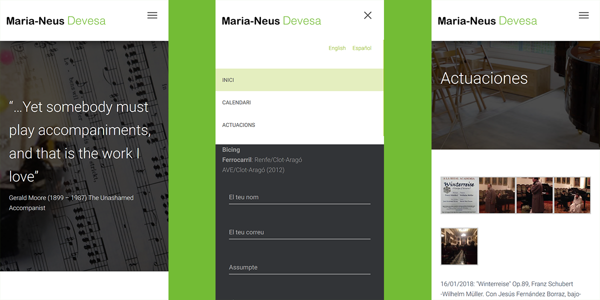
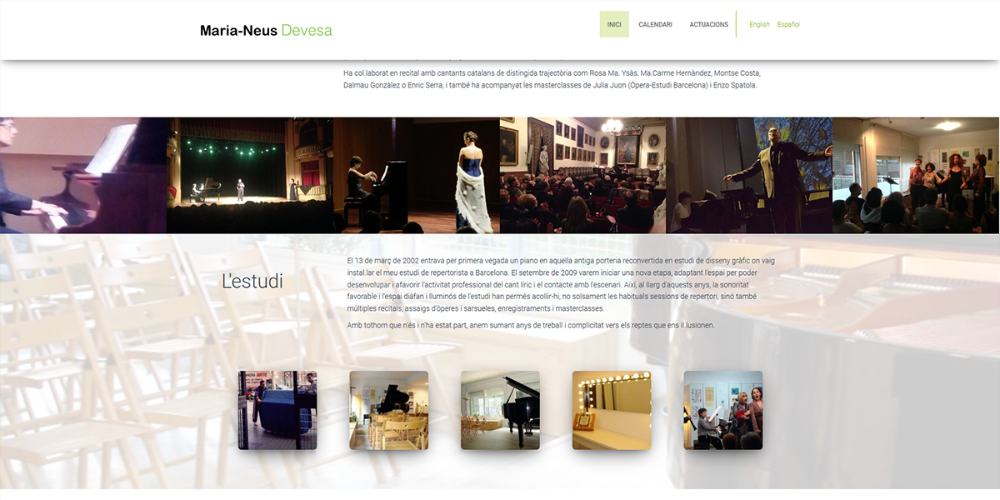
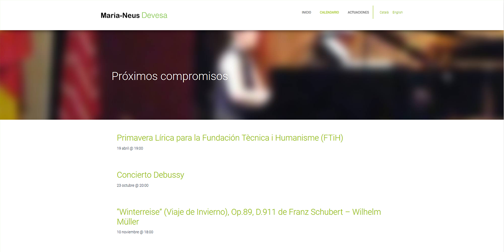

**Maria-Neus Devesa**, una buena amiga y de las mejores repertoristas del país, me pidió actualizar su web, ya muy desfasada en cuanto a contenidos y estilo, por algo más modernos, que pudiera poder gestionar ella misma, donde anunciar sus próximas actuaciones, mostrar galerias de las pasadas y donde puedan contactarla.

La solución más efectiva consistió en adaptar un tema de **Wordpress** más moderno, simplificar la navegación y conseguir páginas con gran cantidad de palabras clave, de forma que el **SEO** y la usabilidad priman en el desarrollo.

Por supuesto algo de lo más importante es que se pueda navegar de forma optima en móvil, porque la mayoria del tráfico le llegará desde las mismas actuaciones en cuanto la busquen. El resultado es una web al gusto de nuestra amiga y con vistas al futuro.

