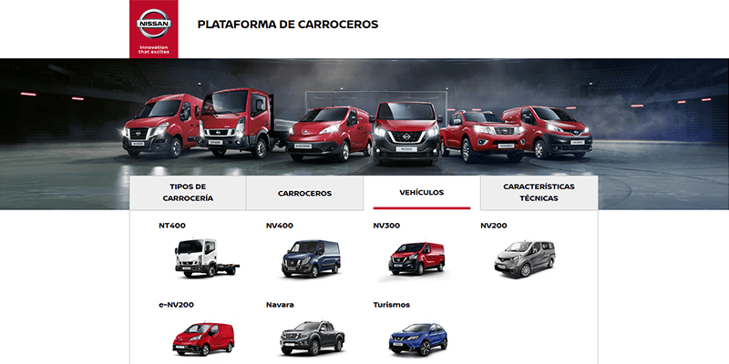
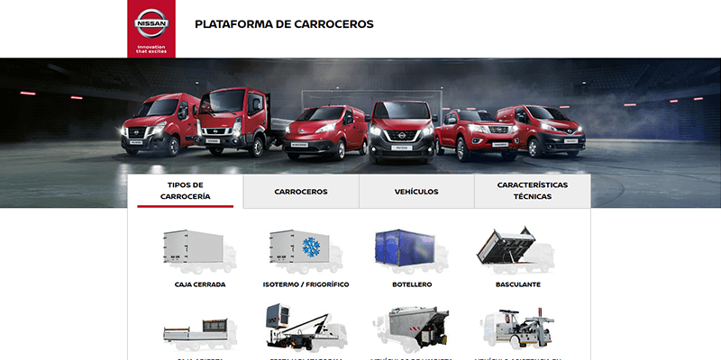
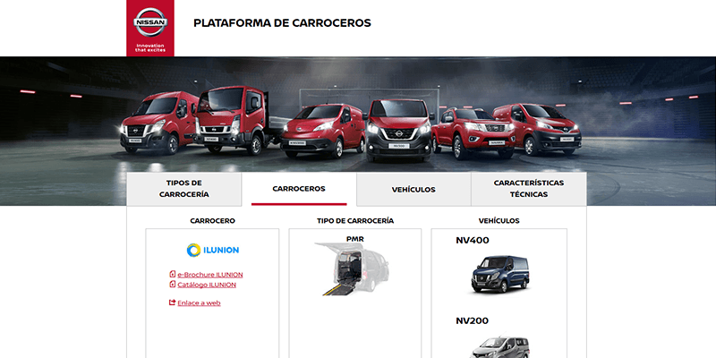

Esta aplicación consiste en un **catálogo virtual para carroceros** de vehículos comerciales. El objetivo es poder mostrar los catálogos correspondientes pudiendo **filtrar entre modelos, carrocerias y carroceros**.

Lo importante es poder escoger entre cualquiera de ellos en cualquier orden, mostrando usa seleccion por columnas de en el orden en que se vayan escogiendo opciones.

La aplicación se alimenta de datos de los productos independientemente de la vista, generando diferentes presentaciones en función de los datos desde la misma página (**Single Page Application**)

