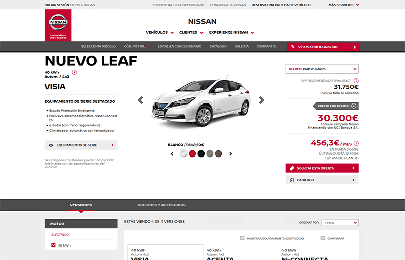
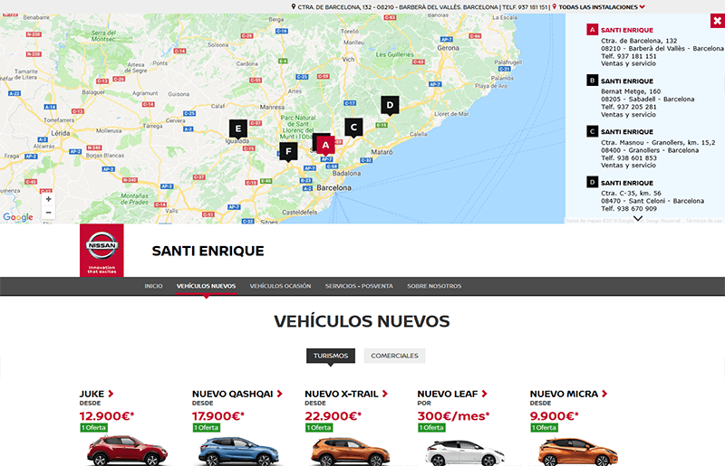
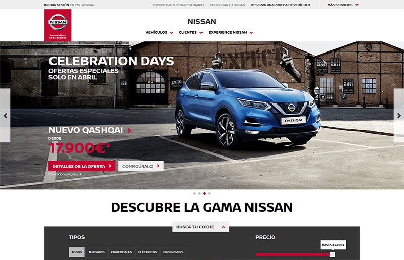
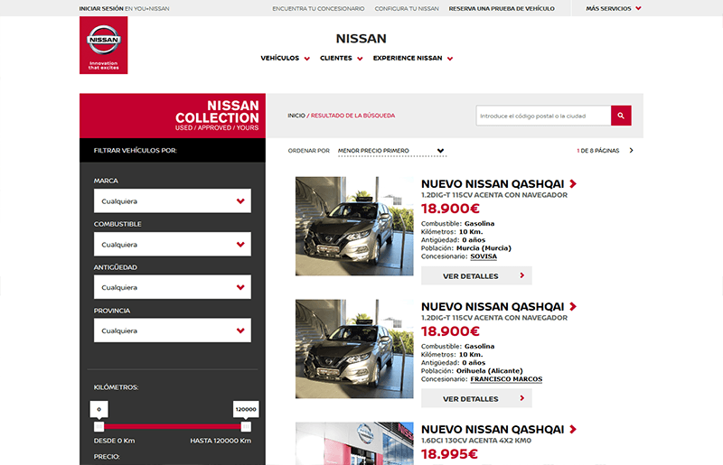

En 2016, Nissan Worldwide se embarcó en un rebranding global que afectaba a todas las plataformas locales. Con un nuevo logo ligeramente diferente al anterior y un restyle general de todas sus webs, nosotros debíamos hacer encajar todas las plataformas locales ya publicadas al nuevo diseño.

Con plazos ajustados y unas guidelines confusas nos embarcamos en actualizar las vistas de todas las plataformas, en algunos casos tocó hacerlas nuevas.

Había que tener en cuenta que no solo se trataba de cambiar estilos, sino que algunos elementos de la navegación que usábamos no cumplian con las nuevas especificaciones de Helios y hacía falta reconstruirlos.

El resultado fueron cuatro plataformas locales lanzadas a tiempo en dos paises y posterior restyling de todas las landings "menores".

