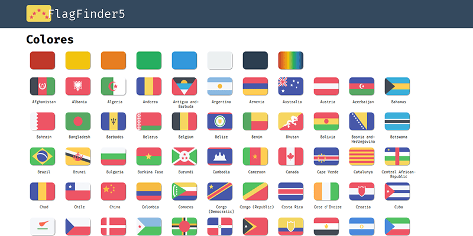
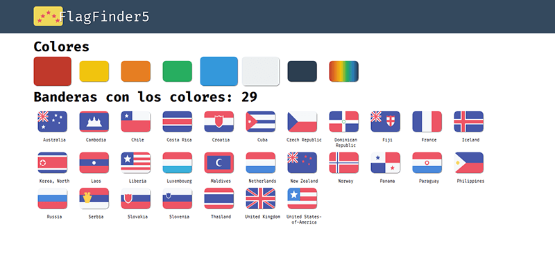

Se trata de un proyecto personal en el que quise practicar con **cellJS** una librería de JS que permite crear componentes mediante JSON de forma descentralizada.

A veces en algúna película vemos banderas que no identificamos fácilmente, por eso pensé que si se pudieran filtrar todas la banderas del mundo y las filtramos por colores obtendríamos una lista más reducida desde la que identificar la bandera vista.

