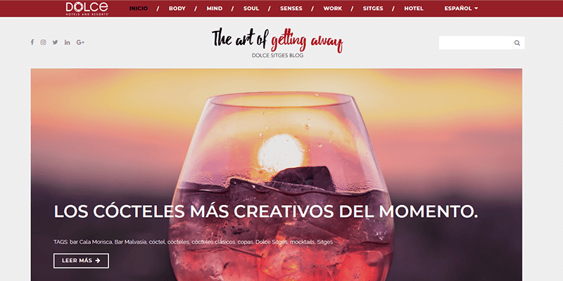
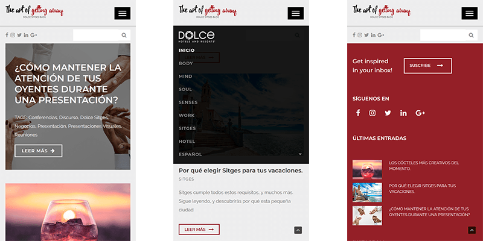

**Dolce Sitges** es un hotel de costa con un estilo únic e inovador, aunque ya dispone de web corporativa donde mostrar las instalaciones y realizar reservas, carecía de un blog y estrategía en redes sociales.

Usamos un Wordpress para montar el blog según su imagen y estilo corporativo, modificando un theme para ajustarlo a sus necesidades. Dando especial importancia a las imágenes y ofrecer una navegación **centrada en el contenido**.

