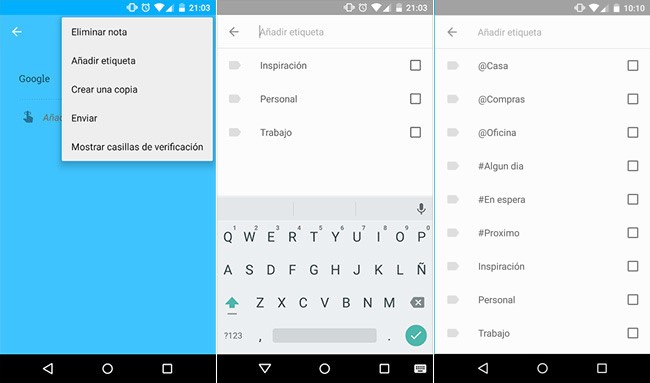

Recientemente Google ha actualizado su aplicación para tomar notas **Google Keep** una de las más sencillas y ligeras del panorama. Poco a poco vemos como Google va mejorando esta herramienta sin recargarla de funciones y opciones, así la mantiene simple y enfocada a su finalidad, **tomar notas**. Después de escribir sobre **Evernote** y como organizarnos con él, quiero describir como aplicar el método del **GTD** con **Google Keep**.

Antes de esta última actualización se hacía casi imposible poder aplicar **GTD** con **Google Keep**, ya que esta herramienta prescindía de cualquier sistema de clasificación. Ahora al menos ya disponemos de etiquetas y una forma de listar las notas según sus etiquetas.

> Hay que recordar que **Google Keep** no es una aplicación pensada para GTD. También hay que recordar que la productividad personal no la crean las herramientas, sino los hábitos de uno mismo.

Lo primero que haremos es aprovechar la nueva función de crear etiquetas para crearnos nuestra estructura. Como una nota puede tener varias etiquetas asignadas, además de las que vienen por defecto (que me parecen útiles), creo etiquetas para entornos y estados diferenciándolas con *@* y *#* quedando así:

 - @Casa
 - @Compras
 - @Oficina
 - _Algún dia
 - _En Espera
 - _Proximo

Como podrás ver no he creado una etiqueta para **Inbox** ya que consideraré que cualquier nota sin etiquetar está en la bandeja de entrada (En este caso una opción de filtrar notas sin etiquetar estaría muy bien)

El proceso es el mismo de siempre, capturamos **TODO** cuanto se nos presenta o recordemos, después procesamos en las diferentes etiquetas (en esta ocasión incluso podemos asignar varias y añadir el entorno, por ejemplo). Después vamos archivando tareas según las vayamos completando.
> Recuerda que lo más importante es **hacer** las cosas y no dejarlas en listas bonitas y ordenadas.
