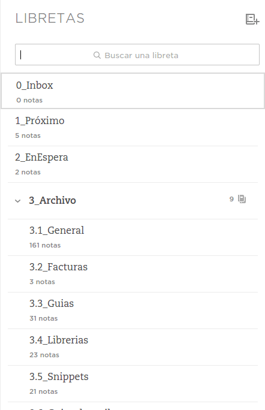

Después de recopilar toda la información y enviarla al *Inbox* toca decidir que hacer con cada elemento, de esta forma sabremos exactamente qué hacer y cuando.

## Ventajas de procesar vs clasificar directamente
Un error muy común al empezar a capturar es tratar de clasificar directamente aquello que vamos a guardar, pero si enviamos todo al *Inbox* y lo procesamos en su momento secuencialmente ganaremos en agilidad, tiempo y menos estres.

- Clasificar directamente nos quita tiempo en el momento de capturar, y recordemos que la recopilación debe ser rápida y ágil.
- Al clasificar directamente, todo nos parece importante, pero si todo el *Inbox* más tarde, seguramente algo de lo recopilado no sea tan importante, haya caducado, o se ha solucionado.
- Procesar nos permite dar un segundo vistazo a lo recopilado, si lo clasificáramos directamente, seguramente lo olvidaríamos.

## Estructura de libretas
Mi estructura de libretas para Evernote es un poco más simple que la de GTD, solo cuento con cuatro libretas (aunque alguna es más bien un stack de libretas), de esta forma es más sencillo establecer el estado de cada una. Sigo la siguiente estructura:

1. Inbox
2. Próximo
3. En Espera
4. Archivo

## Como procesar nuestro *Inbox*
Puede que nos asuste la primera vez que tengamos que procesar nuestra bandeja de entrada, pero es muy sencillo. El procesado también debe ser rápido (en general el método reside en una serie de pasos ágiles y secuenciales, para que no tengamos que pensar).

Abre tu bandeja de entrada de Evernote (la libreta que llamaste *Inbox*). Sigue el siguiente esquema de preguntas:

- Ya no tiene interés: **Borrar**.
- No es una acción: **Archivar**.
- Puede hacerla otra persona: **Delegar**.
- Todavía no se puede empezar: **En espera**.
- En otro caso: **Próximo**.

### Hacer
Una vez ya hemos identificados aquellas tareas que hemos de hacer nosotros y podemos acometerlas ya, solo nos queda abrir la libreta *Próximo* y escoger una tarea para empezar a trabajar sobre ella.

## Algunos trucos para mejorar
Puedes crear una libreta *Delegado* para saber en que estado se encuentran las tareas que has delegado a otra persona o entidad. En ocasiones estas tareas suelen acabar volviendo a uno.

Dentro de *Archivo* tengo creadas varias libretas con diferentes áreas para organizar el material que almaceno. Además acostumbro a numerar las libretas para tener mi propio orden.

Otra libreta que puede ser interesante es una para *Lecturas*, en la que puedes recoger con el *Web Clipper* textos, noticias y posts (como este) que quieras leer mas tarde, tal vez en un momento de tu fin de semana, en el balcón de tu casa con una taza de café. Es como crear tu propio Magazine semanal.

### Usar etiquetas
Una de las grandes ventajas de Evernote es la posibilidad de usar etiquetas para clasificar mejor las notas, por ejemplo a la hora de archivar puedes indicar los temas que conciernen a la nota, o puedes indicar a quien delegaste una tarea añadiendo una etiqueta con su nombre. Algunos otros ejemplos:

- **Indicar localizaciones**: añadir etiquetas del tipo *Casa*, *Oficina*, *supermercado* o *teléfono*, te puede ayudar a saber que hacer en un momento (o lugar) indicado, por ejemplo, ese momento dedicado a hacer llamadas.
- **Compañeros**: es muy util añadir etiquetas con el nombre de los compañer@s involucrados en una tarea o proyecto.
- **Áreas**: conviene sobretodo para el archivo y lecturas, así podremos encontrar el tema que buscamos con más facilidad (aunque el buscador de la aplicación es excelente).

## Concluyendo
Ahora ya sabemos lo esencial para trabajar con más productividad y menos estrés. Pero el método no se queda aquí, en breve contaré como mantener actualizado nuestro sistema y mas trucos sencillos pero de gran potencial.

## Sigue leyendo
- [Productividad en Evernote](/blog/productividad-en-evernote)
- [Recopilar en Evernote](/blog/recopilar-en-evernote)
- Procesar en Evernote