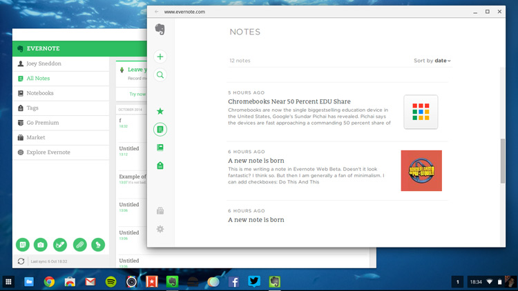

Esta es mi simple implementación de GTD en Evernote. Teniendo en cuenta que lo más importante son los hábitos he tratado de hacer un proceso sencillo y eficaz. Con Evernote y un poco de disciplina podemos tener una vida más organizada y feliz ;)

## El método

No pretendo hacer un resumen del GTD, pues es demasiado extenso, pero si recordar o anticipar algunas de las principales características.

> GTD es el método de productividad creado por David Allen en su libro Getting Things Done, en el cual organiza mediante listas toda la actividad de nuestra vida y mediante su sistema nos encargamos de realizarlas.

> Procuro reducir el método a su esencia, para facilitar la adaptación al método. En próximas entregas añadiré funcionalidades a este método, pero la intención es empezar por algo sencillo.

Los puntos que considero más importantes en su método son:

1. **Vacía tu mente**. Tu mente no está diseñada para almacenar información, de manera que anota TODO lo que tengas que hacer en una lista, y cada vez que entre algo nuevo, anótelo también. De esta forma la mente esta libre para crear e innovar.

2. Interioriza el flujo de trabajo del GTD, para empezar sugiero algo más simplificado que el original de David Allen, donde sólo contemplo 4 pasos:
	- Recopilar
	- Procesar
	- Hacer
	- Revisar

Quiero mostrar como hacerlo desde la versión [web Beta de Evernote](https://www.evernote.com/Home.action), aunque es aplicable a cualquier versión de escritorio o plataforma móvil (de hecho en otros artículos explicaré como trabajar desde varios dispositivos sincronizados)

### Libretas

Mi lista básica de libretas es la siguiente:

- **0_Inbox**: Todo llega aquí desde la recopilación.
- **1_Proximo**: Tareas que puedo realizar desde este momento.
- **2_EnEspera**: Tareas que están pendientes de alguna acción externa, o bien la respuesta de otra persona o bien un momento específico.
- **3_Archivo**: Aquí almaceno material de referencia, guías, lecturas, snippets o cualquier cosa que desee almacenar. De hecho está libre esta dividida en otras para separa contenidos y acceder más fácilmente. Aprovecho para destacar que no es necesario aplicar una estructura supereficiente para poder encontrar las notas a posteriori, pues Evernote dispone de un buscador muy bueno en todas su versiones.
- **4_Listas**: Aquí guardo distintas listas de información rápida, como la lista de la compra, listado de favoritos, libros por leer, películas por ver, etc. También he creado un stack de libretas para organizarlas.

## Flujo de trabajo

### Recopilar

Todas las nuevas tareas que se van presentando las incluyo en la lista *0_Inbox* de mi Evernote. Además utilizo el complemento para el navegador [Evernote web clipper](https://evernote.com/intl/es/webclipper/) con el que puedo capturar cualquier página, imagen, articulo o frase de cualquier web y la guardo directamente en mi inbox.

También utilizo la app del móvil para capturar las ideas al momento que se me ocurren, tomar una fotografía o guardar una tarjeta de visita.

Si no quieres o puedes instalarte más aplicaciones en el navegador o en tu móvil, Evernote dispone de la opción de crear tareas a través del email. De esta forma puedes enviarte (o reenviarte) un email que se convertirá en una nota.

### Procesar

Si metemos todo dentro del mismo saco, nos será muy difícil saber que tenemos que hacer, y la idea es confiar esas decisiones al sistema, para ello cada día (al menos una vez, mejor si son dos veces) deberemos *procesar* nuestra bandeja de entrada.

Como si de correos enviados a nosotros mismos se tratase, analizamos TODAS las notas que tengamos y nos hacemos dos preguntas:

- **¿Es algo que tenga que hacer?**
	- No: Lo archivo o elimino, según mi interés
	- Si: **¿puedo hacerlo ya?**
		- No: lo pongo en la lista *En espera* anotando cuando podré realizarlo.
		- Si: Lo pongo en la lista *Próximo*, donde está todas las tareas que ya puedo acometer.

### Hacer

Llegado la hora de trabajar (no nos engañemos, que todo esto se hace para trabajar) abrimos nuestra lista de *Próximo* y escogemos una tarea para hacer.

### Revisar

Para que el método realmente funcione debemos revisarlo regularmente. Aconsejo hacer una revisión semanal completa, en la cual no solo repasamos las carpetas *Inbox* y *Próximo* sino que además repasamos la lista *En espera* por si hay alguna tarea que ya podemos acometer.

## Las otras herramientas

Como ya sabemos, utilizaremos Evernote como herramienta principal para el método, pero además usaremos algún servicio online para complementar la aplicación. Estas son algunas de las herramientas que recomiendo, espero en próximos artículos poder ampliar cada una de ellas.

### Evernote App

Aunque el flujo principal lo desarrollemos con la versión web, también empleo la app del móvil para tener acceso constante a mis listas y poder capturar cuando lo necesito.

Puedes descargar Evernote para (casi) cualquier plataforma desde [la web de Evernote](https://evernote.com/intl/es/products/).

### Evernote web clipper

Muy útil para capturar información de la web e introducirla en nuestro sistema de listas, [Descarga el complemento](https://evernote.com/intl/es/webclipper/)

### IFTTT

Perfecto para automatizar las tareas de recopilado, regístrate desde [su web](http://ifttt.com). En próximos artículos explicaré algunas recetas para usar este servicio junto con Evernote.

### Email ;)

No podía faltar la herramienta más estándar en nuestros equipos, todos tenemos cuenta de email y casi todo nuestro trabajo pasa por ahí, aprenderemos a usarlo en breve.

## Sigue leyendo
- Productividad en Evernote
- [Recopilar en Evernote](/blog/recopilar-en-evernote)
- [Procesar en Evernote](/blog/procesar-en-evernote)